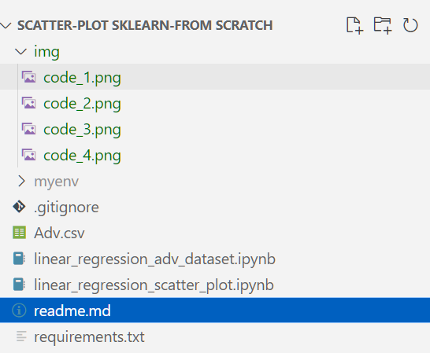

# 📈 Scatter Plot and Linear Regression Projects

This repository contains two projects that demonstrate linear regression concepts from scratch and using Scikit-learn on synthetic and real-world datasets.  
Both projects walk through 
   **data generation/loading**, **visualization**, **manual model training (Gradient Descent)**, **model evaluation**, and **comparison with Scikit-learn's `LinearRegression`**.

---

## 📂 Project Structure

---

## 📝 Project Descriptions

### 1. Linear Regression on Randomly Generated Data
- **File:** `linear_regression_scatter_plot.ipynb`
- **Goal:** 
  - Generate a simple linear dataset with noise.
  - Visualize the data.
  - Train a linear regression model manually using gradient descent.
  - Plot training vs testing data and loss curve.
  - Evaluate model performance (MSE, MAE, R²).
  - Compare with Scikit-learn's `LinearRegression`.

---

### 2. Linear Regression on Advertising Dataset
- **File:** `linear_regression_adv_dataset.ipynb`
- **Goal:** 
  - Load a real-world advertising dataset (`Adv.csv`).
  - Predict `Sales` based on `TV`, `Radio`, and `Newspaper` advertising budgets.
  - Train a multivariable linear regression model manually.
  - Visualize error progression.
  - Evaluate and compare manual model vs Scikit-learn model.

## 🚀 How to Run

1. **Clone the repository**

   

2. **Create a virtual environment and activate it**

    

3. **Install dependencies**

    

4. **Launch Jupyter Notebook**

    

5. **Open the .ipynb files and run cells!**

## 🛠️ Built With

- Python

- NumPy

- Pandas

- Matplotlib

- Scikit-learn

- Jupyter Notebook

## 📊 Outputs and Visualizations

- Scatter plots of generated or real data

- Trained model fit lines

- Training and testing datasets visualization

- MSE loss curves

- Evaluation metrics (MSE, MAE, R²)

